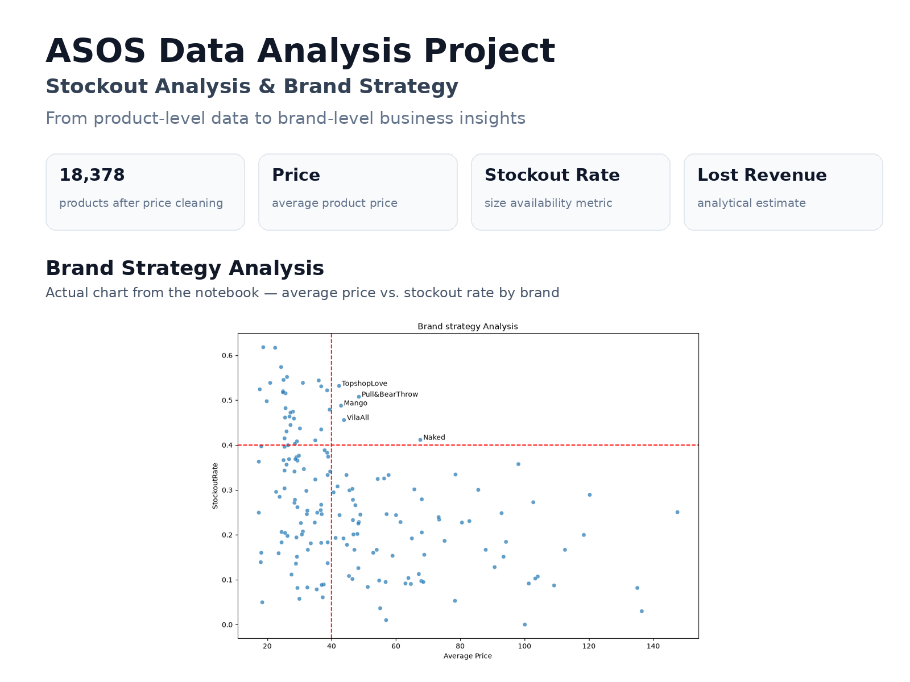
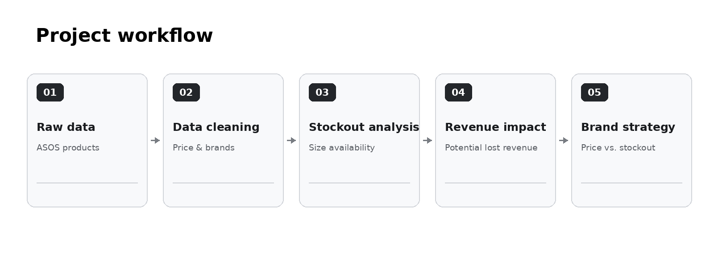
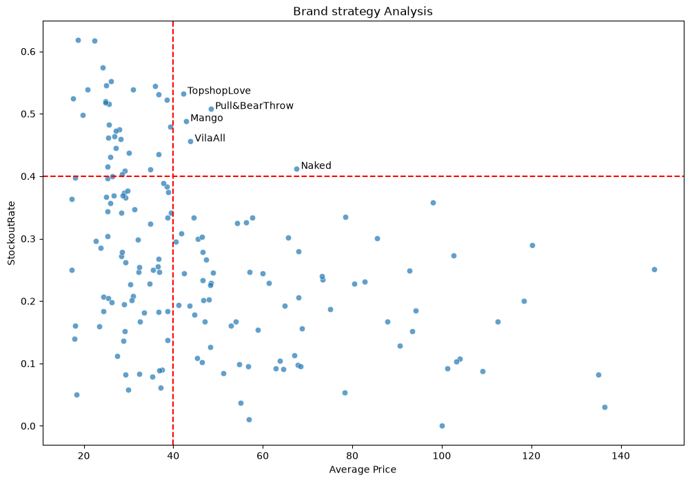

# ASOS Product & Brand Strategy Analysis



## 📌 Project Overview

This portfolio project analyzes ASOS product data to identify potential inventory and revenue opportunities at the brand level.

The analysis focuses on the relationship between **product price, size availability, stockout rate and potential lost revenue**.

The main goal is to move from raw product-level data to actionable brand-level insights that could support inventory and commercial decisions.

---

## 🎯 Business Questions

- Which brands have relatively high average product prices?
- Which brands experience higher stockout rates?
- How can unavailable sizes be translated into a potential revenue impact?
- Which brands may require further investigation from an inventory-management perspective?

---

## 🔄 Analysis Workflow



---

## 🗂 Dataset

The project uses an ASOS product dataset containing product-level information such as:

- product name
- category
- price
- color
- available sizes
- SKU
- product description
- image URLs

The initial dataset contains **18,378 product records** after loading and basic price cleaning.

---

## 🧹 Data Preparation

The analysis includes:

1. Loading the raw product dataset.
2. Converting product prices to numeric values.
3. Removing records without a valid price.
4. Extracting brand names from product descriptions.
5. Standardizing inconsistent brand names.
6. Filtering out brands with insufficient product representation.

This preparation makes the data more suitable for comparing brands rather than individual product records only.

---

## 📊 Key Metrics

### Stockout Rate

The stockout rate measures the share of unavailable sizes for a product.

It is calculated from the size availability information contained in the dataset.

### Potential Lost Revenue

The project estimates potential lost revenue by combining:

**product price × number of unavailable sizes**

This metric should be interpreted as an analytical estimate rather than actual realized revenue loss.

---

## 📈 Brand-Level Analysis

After calculating product-level metrics, the data is aggregated by brand.

For each brand, the analysis compares:

- average product price
- average stockout rate
- average potential lost revenue
- number of products

Brands with more than 10 products are used in the final comparison to reduce the impact of very small samples.

---

## 🔎 Strategic Segmentation

The final visualization compares:

- **X-axis:** Average Price
- **Y-axis:** Stockout Rate

Reference thresholds are used to highlight brands with:

- average price above **40**
- stockout rate above **40%**

These brands represent potentially important cases for further investigation because they combine relatively high product prices with relatively high levels of unavailable sizes.



---

## 💡 Business Interpretation

A high stockout rate does not automatically mean that a brand performs poorly.

However, when high stockout rates occur together with relatively high prices, the situation may deserve additional attention because unavailable sizes can create a potential opportunity cost.

The analysis can therefore be used as a starting point for questions such as:

- Should inventory levels be reviewed for specific brands?
- Are high-value products disproportionately affected by stockouts?
- Which brands may have the greatest potential revenue impact from unavailable sizes?
- Should replenishment priorities differ across brands?

---

## 🛠 Tools & Technologies

- **Python**
- **Pandas** — data loading, cleaning and aggregation
- **Matplotlib** — visualization
- **Seaborn** — statistical visualization
- **Jupyter Notebook**
- **Git / Git LFS** — project and dataset version control

---

## 📁 Project Structure

```text
Python_project/
│
├── README.md
├── Python_project.ipynb
├── products_asos.csv
│
└── assets/
    ├── project_overview.png
    ├── analysis_workflow.png
    └── brand_strategy_analysis.png
```

---

## ⚠️ Notes & Assumptions

The stockout and lost-revenue metrics are analytical estimates based on the size availability information in the source dataset.

Potential lost revenue should therefore be treated as an **estimated opportunity cost**, not confirmed sales that were actually lost.

The analysis is intended as a portfolio demonstration of data cleaning, feature engineering, exploratory analysis, visualization and business-oriented interpretation.
